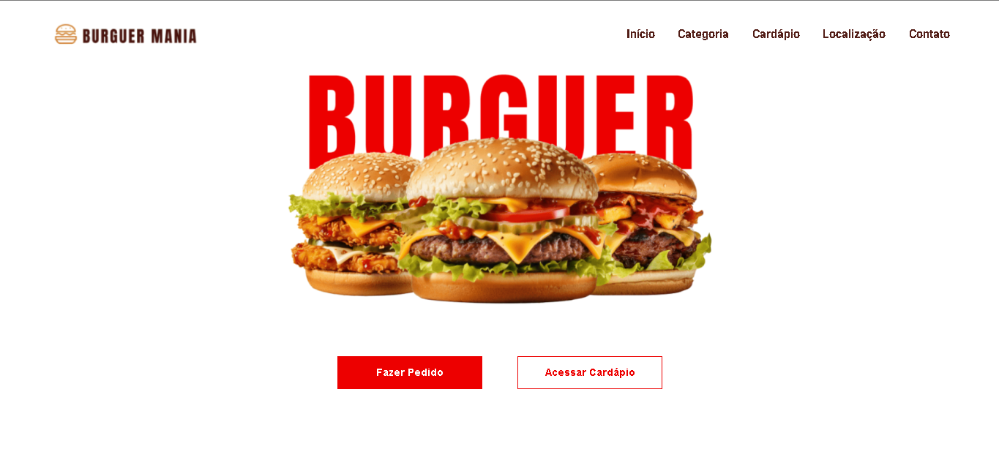

# Projeto Unidade 9 - BurguerMania

Esse projeto visa aprimorar a habilidade de nós residentes da Restic36 com o desenvolvimento Front-End. O ojetivo Geral do projeto é criar uma aplicação Front-End com base em protótipo do Figma onde a página seja interativa e atenda os tópicos exigidos, como por exemplo a componentização, roteamento, Estilos Globais com Variáveis CSS, dentre outros.

## Dificuldades

No geral ainda tenho certas dificuldades na manipulação de dados para apresentação em tela. Infelizmente acabei não conseguindo desenvolver a pagina de detalhes do produto. Em contrapartida, com o tempo disponível que tive consegui deixar a página responsiva e os outros tópicos que foram desenvolvidos esceto a página de detalhes ficaram bem interativos. No geral com as adversidades e minha dificuldade em alguns tópicos me sinto satisfeito com o resultado obtido.



## Pré-requisitos

Verifique se você possui os seguintes softwares instalados:

- [Node.js](https://nodejs.org/) (Recomendada a versão v20.11.1 ou superior)
- [Angular CLI](https://angular.io/cli) (se ainda não tiver, você pode instalá-lo globalmente com o comando `npm install -g @angular/cli`)

O projeto foi desenvolvido na versão do Angular 17.3.11

## Instalação

1. **Clone o repositório**:

   ```bash
   git clone https://github.com/ClRIUS/Projeto-3.git
   cd BurguerMania
   ```

2. **Instale o Angular CLI caso não tenha**:

   Execute o seguinte comando:

   ```bash
   npm install -g @angular/cli
   ```
   
2. **Instale as dependências**:

   Execute o seguinte comando para instalar todas as dependências necessárias do projeto:

   ```bash
   npm install
   ```


## Executando o Projeto

Para iniciar o servidor de desenvolvimento e executar o projeto, use o comando:

```bash
ng serve
```

O aplicativo estará disponível em [http://localhost:4200](http://localhost:4200).


## Tecnologias utilizadas
- Angular versão 17.3.11
